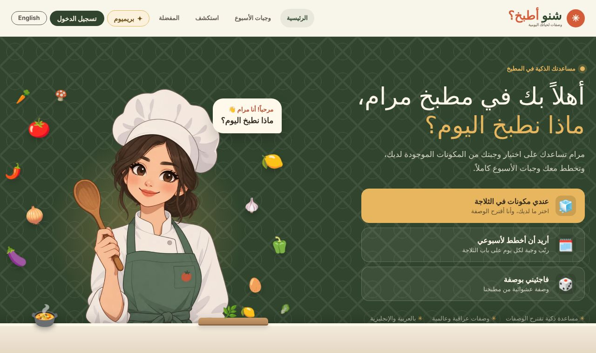
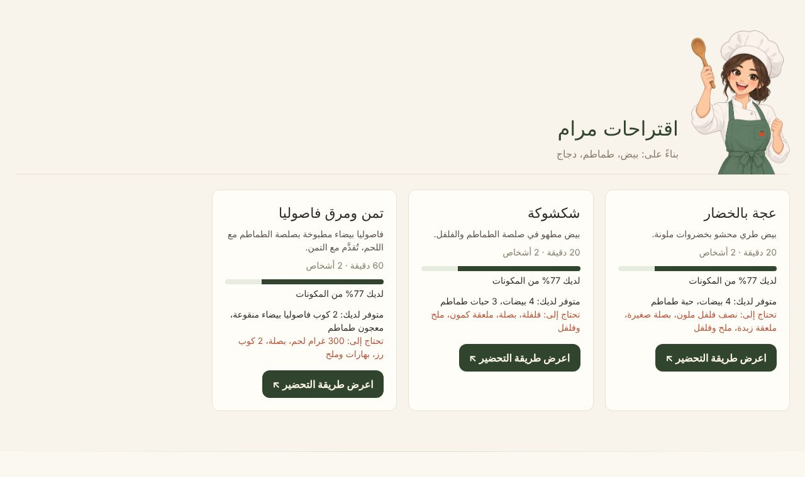
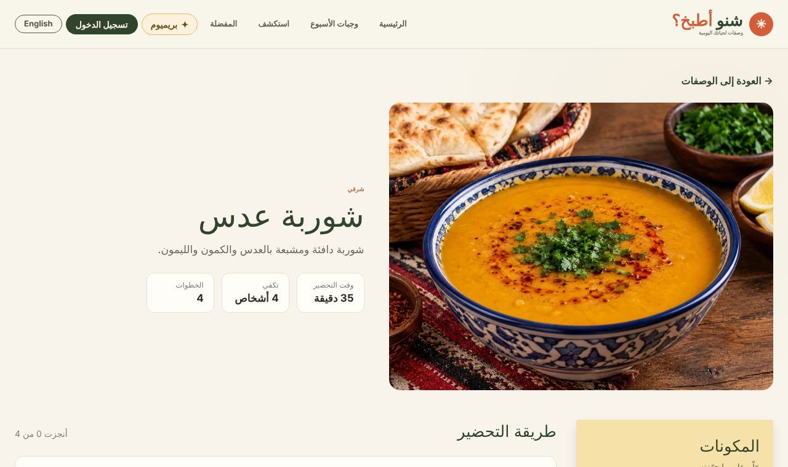
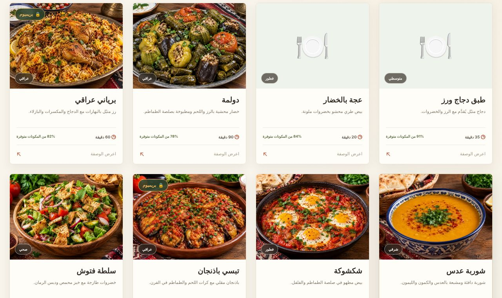
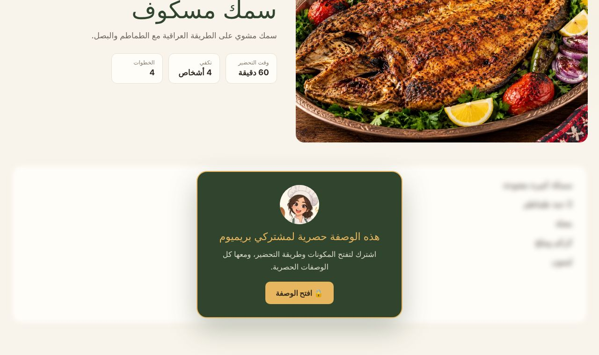
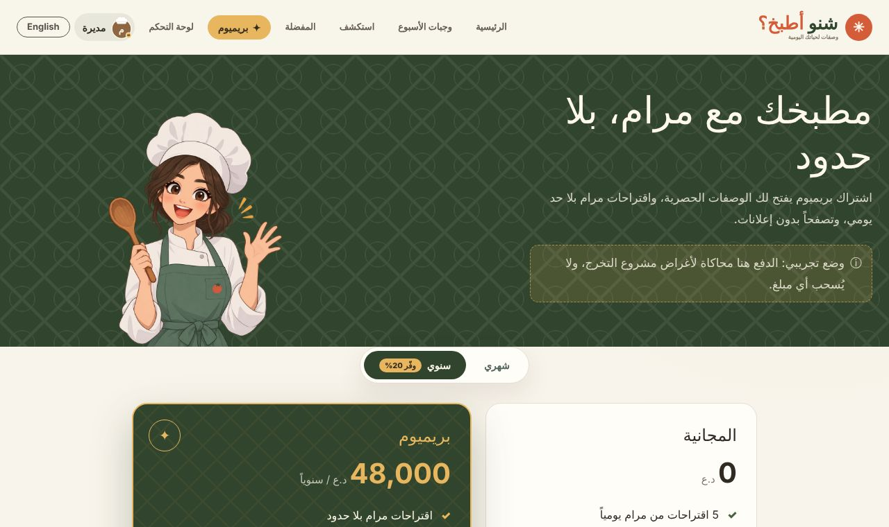
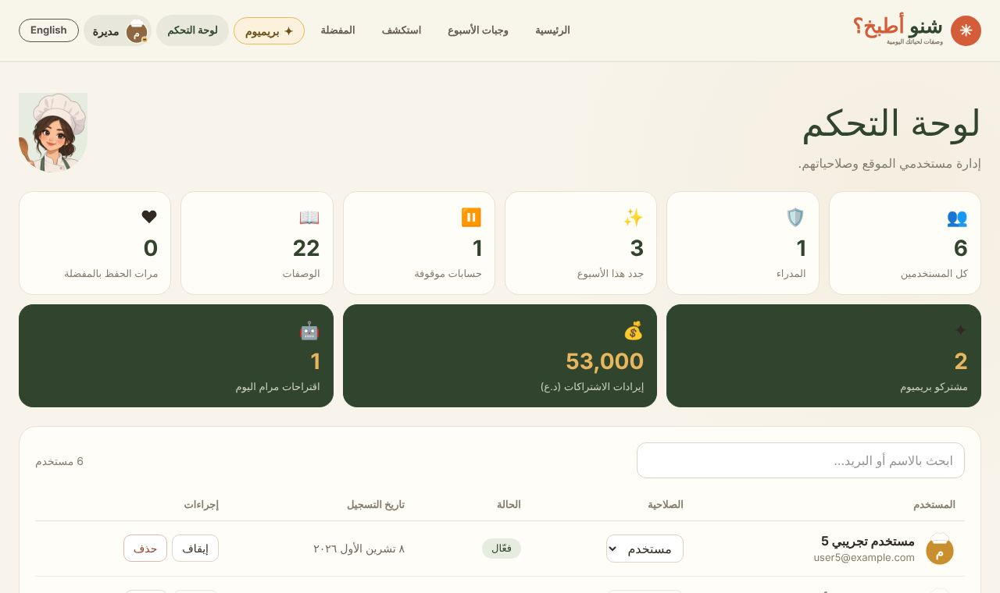

<div dir="rtl" align="right">

# 🍳 شنو أطبخ؟

**منصة وصفات ذكية، تقترح عليك شنو تطبخ من المكونات اللي عندك، ويا مساعدة ذكية اسمها «مرام».**

### 🔗 [جرّب الموقع مباشرة](https://engsarahcmc.github.io/shino-atbakh/)

حساب تجريبي للمدير (حتى تشوف لوحة التحكم): `demo@shno.app` / `demo1234`



## الفكرة

كل يوم نسأل نفس السؤال: **شنو أطبخ اليوم؟** نضيع وقت ونفتش بأكثر من موقع، ومكونات تضل بالثلاجة لحد ما تخرب، وأغلب التطبيقات أجنبية وما تعرف أكلاتنا.

«شنو أطبخ؟» يحول هذا السؤال لتجربة سهلة: تختار اللي بثلاجتك، ومرام تقترح وصفات تناسبك، بالعربي والإنكليزي.

المنصة للجميع. مثلاً الأم الموظفة اللي ما عندها وقت تفكر، أو طالب القسم الداخلي اللي عنده مكونات قليلة.

## الميزات

| الميزة | الوصف |
|---|---|
| 🤖 **مرام** | مساعدة ذكية مربوطة بـ Google Gemini، تقترح وصفات حسب المكونات وعدد الأشخاص |
| 🧊 **الثلاجة التفاعلية** | تختار المكونات بالضغط، بدون كتابة |
| 📖 **صفحة الوصفة** | المكونات بالكميات وخطوات التحضير |
| 📅 **أكلات الأسبوع** | تخطيط وجبات الأسبوع |
| 🔍 **استكشف والمفضلة** | 22 وصفة عراقية وعالمية، فلترة، وحفظ المفضلة |
| 👤 **الحسابات** | تسجيل بالإيميل أو بحساب Google |
| ✦ **اشتراك Premium** | وصفات حصرية ومرام بلا حدود، ويا دفع تجريبي (زين كاش، كي كارد، فاست پاي) |
| 🛡️ **لوحة التحكم** | إدارة المستخدمين والصلاحيات، وأرقام المشتركين والإيرادات |
| 🌐 **لغتين** | عربي (من اليمين لليسار) وإنكليزي |

## صور من المنصة

| الثلاجة التفاعلية | اقتراحات مرام |
|---|---|
|  |  |
| **صفحة الوصفة** | **استكشف الوصفات** |
|  |  |
| **وصفة حصرية لمشتركي Premium** | **صفحة Premium** |
|  |  |



## نموذج الربح

- **اشتراك Premium** (منفّذ): 5,000 د.ع شهرياً أو 48,000 د.ع سنوياً. المجاني: 5 اقتراحات من مرام باليوم.
- **إعلانات** علامات غذائية بين الوصفات، تختفي للمشتركين.
- **شراكات** ويا المتاجر: طلب مكونات الوصفة من متجر شريك مقابل عمولة.

## التطوير المستقبلي

مجتمع للمشاركة والتعليقات والتقييمات، ومتجر للمكونات، وتطبيق موبايل (Android و iOS)، ومرام أذكى تتعلم من ذوق المستخدم.

## التقنيات

- **الواجهة:** React، Vite، Tailwind CSS
- **الباكند:** Node.js، Express، PostgreSQL، JWT
- **الذكاء الاصطناعي:** Google Gemini API

## عن النسخة المنشورة

الرابط فوق **نسخة تجريبية للعرض** تشتغل بدون سيرفر: البيانات تنحفظ بمتصفح الزائر فقط، ومرام تقترح من وصفات الموقع نفسها، والدفع محاكاة. النسخة الكاملة (مرام بالذكاء الاصطناعي وقاعدة البيانات) تشتغل بتشغيل السيرفر، مثل الخطوات تحت.

## التشغيل الكامل

</div>

```bash
# 1) قاعدة البيانات
psql -U postgres -c "CREATE DATABASE shno_atbakh;"
psql -U postgres -d shno_atbakh -f server/sql/schema.sql

# 2) السيرفر (المنفذ 3000)
cd server
npm install
cp .env.example .env   # عبّي القيم: قاعدة البيانات، JWT_SECRET، GEMINI_API_KEY
npm run dev

# 3) الواجهة (المنفذ 5173)
cd client
npm install
npm run dev
```

<div dir="rtl" align="right">

## عن المشروع

طوّرته **سارة** ([@engsarahcmc](https://github.com/engsarahcmc))، قائدة الفريق والمطورة الرئيسية: ميزة مرام والذكاء الاصطناعي، وإعادة تصميم الواجهة، ونظام Premium ولوحة الأرباح.
بدأ كمشروع تخرج في الـ Full-Stack، ويا مساهمة **فاطمة** في الباكند و**زهراء** في التصميم الأولي.

</div>

---

## English

**Shno Atbakh? ("What should I cook?")** is a smart recipe platform. Pick what's in your fridge and **Maram**, an AI cooking assistant powered by Google Gemini, suggests recipes that fit, in Arabic or English.

🔗 **[Live demo](https://engsarahcmc.github.io/shino-atbakh/)** (admin demo account: `demo@shno.app` / `demo1234`). The live demo runs without a server: data stays in your browser, Maram picks from the site's own recipes, and payments are simulated.

**Features:** AI suggestions, interactive fridge, recipe pages with quantities and steps, weekly meal planner, explore and favourites, email or Google sign-in, Premium subscription with demo payments, admin dashboard with revenue figures, Arabic (RTL) and English.

**Stack:** React, Vite, Tailwind CSS · Node.js, Express, PostgreSQL, JWT · Google Gemini API.

Built by **Sara** ([@engsarahcmc](https://github.com/engsarahcmc)), team lead and main developer, with contributions from Fatima (backend) and Zahraa (initial design).
